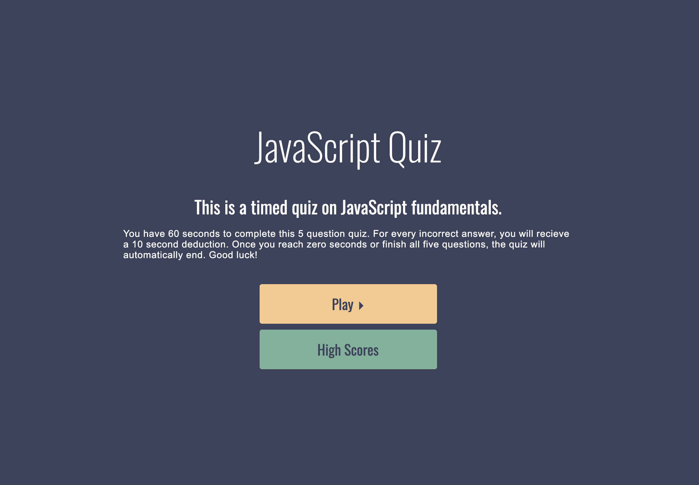

# JavaScript_Quiz

This is a timed quiz on JavaScript fundamentals. The user has 60 seconds to complete this 5 question quiz. For every incorrect answer, they will recieve a 10 second deduction. Once the timer reaches zero seconds or all five questions are completed, the quiz will automatically end.

Link to live site:

Screen shot of homepage:

